# Rossmann Store Sales Prediction
Este repositório contém script para previsão de vendas

 

# _Objetivo do projeto_

Fazer a previsão de vendas de todas as unidades da rede, para isso, uma parcela do faturamento de cada loja deverá ser destinada para reforma da mesma nas próximas 6 semanas.

 

# _1. Problema de Negócio_

A Rossmann é uma empresa farmacêutica da Europa e todo final de mês existe uma reunião com todos os gerentes destas lojas para apresentar os resultados.
Na reunião do último mês o CFO (Chief Financial Officer) pediu para todos os gerentes das lojas fizessem uma predição das próximas seis semanas de vendas de cada uma das suas lojas.
Então depois desta reunião de resultados os gerentes saíram com esta tarefa de fazer esta predição.

Neste cenário fictício, nossa fonte de dados é um arquivo csv de uma competição do Kaggle [clicando aqui](https://www.kaggle.com/c/rossmann-store-sales/data).

 

# _2. Justificativa_

- **Por quê:** Dificuldade em determinar o valor do investimento para reformas de cada loja.
- **Como:** Com a método CRISP-DM.
- **O quê:** Um modelo Machine Learning para realizar a previsão de vendas de todas as lojas.

 

# _3. Premissas_

As variáveis originais do conjuto de dados são: 

Variável | Definição
------------ | -------------
Store | identificador único da loja|
DayOfWeek | dia da semana (1 = segunda-feira / 7 = domingo)|
Sales | vendas/dia (objetivo)|
Customers | número de clientes no dia.|
Open | indica se a loja está aberta ou fechada (1 = aberta / 0 = fechada)|
Promo | se existe uma promoção no dia ( 1 indica que estava ocorrendo uma promoção nesta loja)|
StateHoliday | indica um feriado estadual (a = feriado público / b = feriado da páscoa / c = natal / 0 = nenhum tipo de feriado neste dia)|
SchoolHoliday | feriado escolar (1 = feriado escolar / 0 = não é feriado escolar)|
Store | identificador único da loja.|
StoreType | tipo da loja, diferencia entre 4 modelos de loja diferentes: a, b, c, d|
Assortment | descreve um nível de sortimento (a = básico / b = extra / c = estendido)|
CompetitionDistance | distância da loja do concorrente mais próxima.|
CompetitionOpenSinceMonth | fornece o mês aproximado em que o concorrente mais próximo foi aberto.|
CompetitionOpenSinceYear | fornece o ano aproximado em que o concorrente mais próximo foi aberto.|
Promo2 | Promo2 é uma promoção adicional para todas as lojas ( 0 = a loja não está participando / 1 = a loja está articipando)|
Promo2SinceWeek | descreve a semana do calendário em que a loja começou a participar do Promo2.|
Promo2SinceYear | descreve o ano do calendário em que a loja começou a participar do Promo2.|
PromoInterval | descreve os intervalos consecutivos em que a Promo2 é iniciada, nomeando os meses. Por exemplo, "fevereiro, maio, agosto, novembro" significa que cada rodada começa em fevereiro, maio, agosto, novembro de qualquer ano para essa loja.|

 

# _4. Planejamento da Solução_

O planejamento da solução para este projeto se baseia no método CRISP-DM (Cross Industry Standard Process for Data Mining), que é uma metodologia cíclica e flexivel voltada para resolução de problemas que envolvem grande volume de dados que permite a entrega rápida de valor para os times de negócio.

Segue abaixo uma breve ilustração das principais etapas desse processo:

 

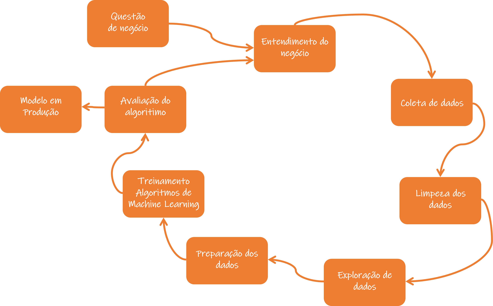

 

# _5. Insights_

*Resumo dos insights durante análise exploratória de dados (EDA):*

**Gráfico para saber o número das vendas por ano.**

 

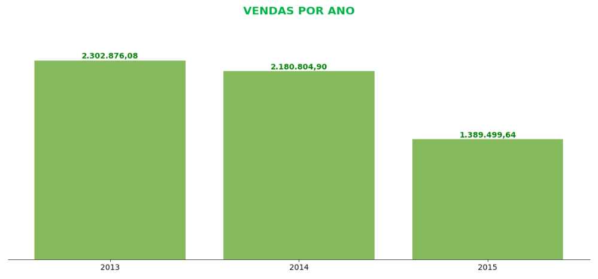

 

 

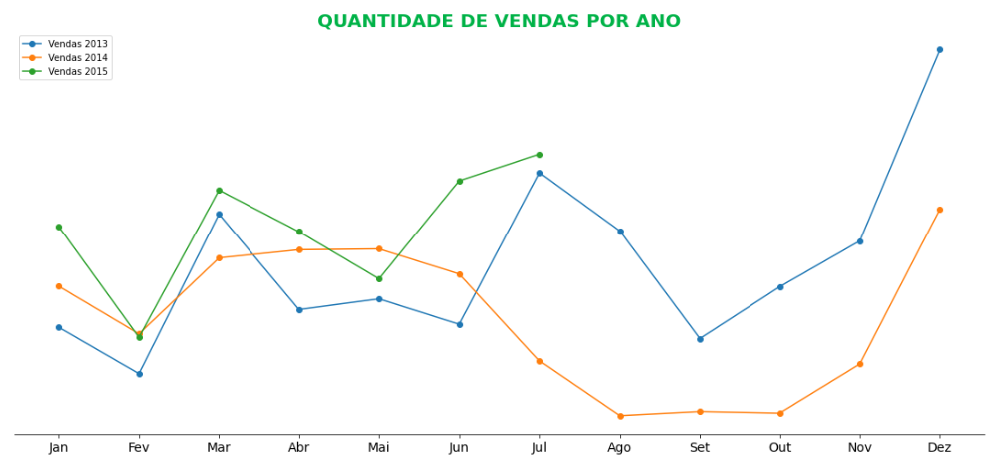

 

**Nota:**
- Temos uma queda nas vendas ao decorrer dos anos, que precisa ser analisado, para não afetar as vendas de 2015.
- Mas comparando o mesmo período de meses entre 2014 e 2015 temos um aumento de 6%.
- No no de 2015 até o mês de julho temos um crescimento de 6%, mas seria importante analisar o comportamento das vendas de 2014, para compreender o motivo da queda das vendas.

**Gráfico para visualizar a soma das vendas por mês.**

 

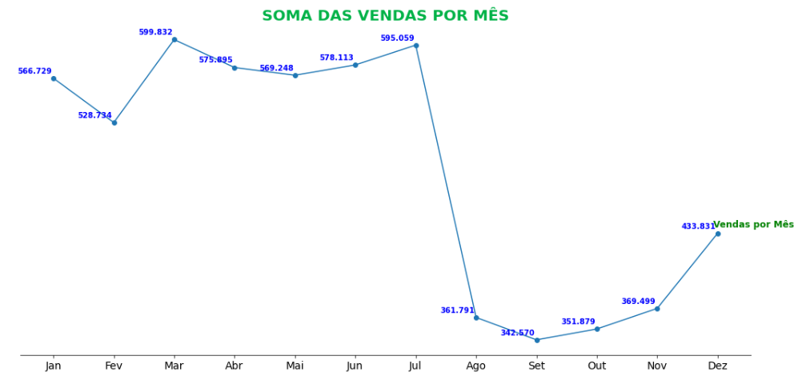

 

**Nota:**
- Por meio deste gráfico podemos perceber que no mês de novembro e dezembro segue uma sequência de aumento das vendas que pode ser explicada pela Black Friday e Natal, com está visualização a empresa pode fazer um planejamento de qual mês é mais importante para empresa para deixar preparado o estoque.

**Gráfico para visualizar a soma das vendas por dia.**

 

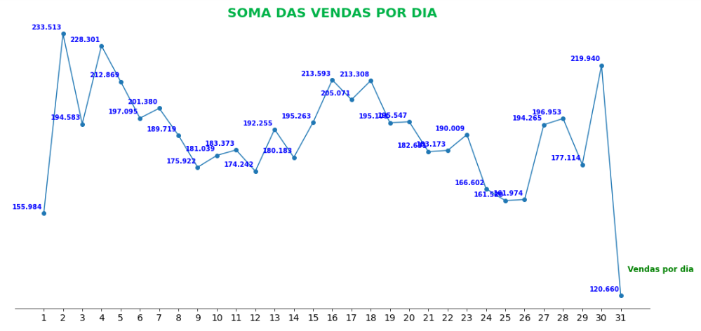

 

**Nota:**
- Podemos perceber que as vendas no final do mês, apresenta uma queda bem acentuada nas vendas.

**Gráfico para visualizar a soma das vendas por dia da semana.**

 

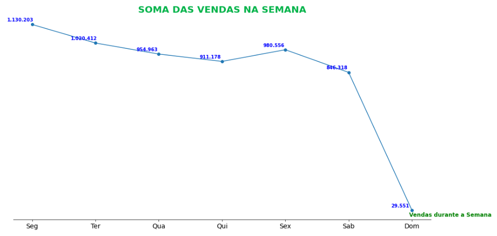

 

**Nota:**
- Podemos ver que o menor pico de vendas é no domingo, esta é uma informação que precisa compreender melhor este comportamento.

**Gráfico para visualizar o número de cliente que vão na loja por mês.**

 

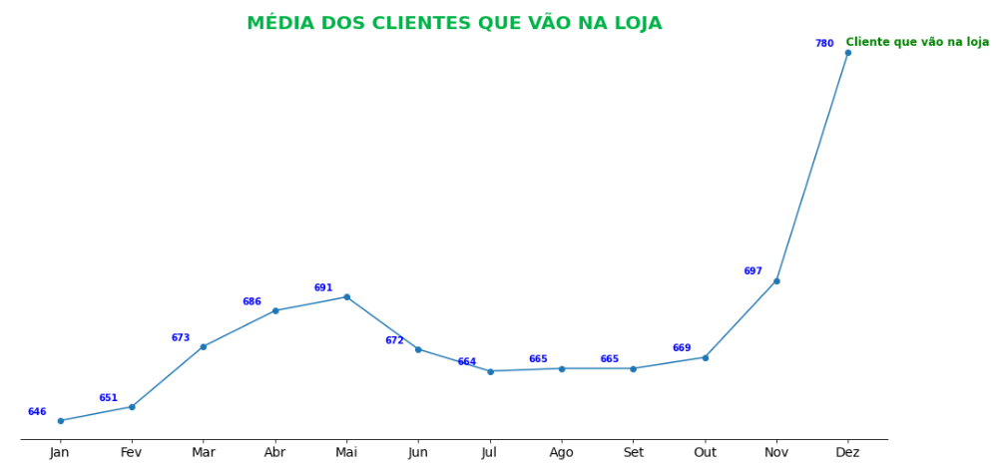

 

**Nota:**
- O aumento da média de cliente no mês de novembro e dezembro pode ser explicado pela Black Friday e Natal, com está visualização a empresa pode fazer um planejamento de qual mês é mais importante para empresa para deixar preparado o estoque e os funcionários.

**Gráfico para saber se a promoção afeta o número de cliente.**

 

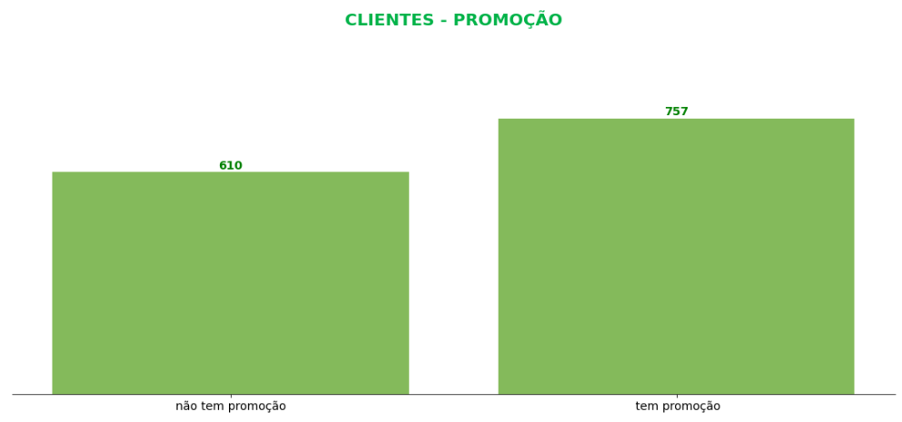

 

**Nota:**
- Podemos afirmar que quando têm promoção o número de cliente não aumentam muito (147), porém o número de vendas aumenta consideravelmente, pode ser que vários clientes acabam combrando mais produtos.

**Gráfico para saber se a promoção afeta as vendas.**

 

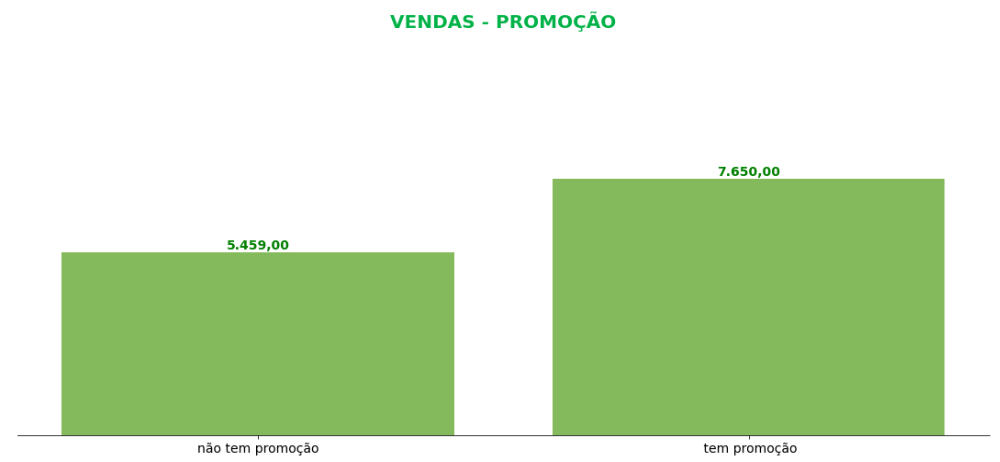

 

**Nota:**
- Podemos perceber que quando temos promoção na loja as vendas aumentam cerca de 12%.

# _6. Modelos de Machine Learning_

1. Average Model
2. Linear Regressor
3. Linear Regressor Regularizaded (Lasso)
4. Random Forest Regressor
5. Prophet
6. XGBoost Regressor

 

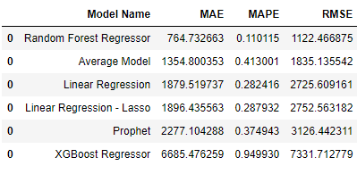

 

 

# _7. Performance do Modelo de Machine Learning_

Comparando o desempenho dos modelos - Cross Validation.

 

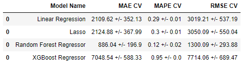

 

**Nota:**

- Também podemos observar a tabela final e ver que Random Forest Regressor tem uma performance melhor que todos os outros modelos.

 

# _8. Resultado Negócio_

Após a escolha do nosso algoritmo, somos capazes de visualizar alguns cenarios do ponto de vista de negócio.

  
 

 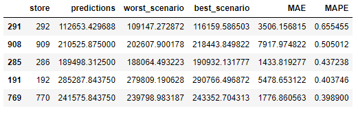
 

  

 **Nota:**

 - Na loja 286, vamos fazer  189.498 reais de receita nas próximas 6 semanas com um erro de 4%, que corresponde a 1.433 reais.
 - No pior cenário podemos vender 188.064 reais e no melhor 190.932 reais.

**Gráfico para visualizar a performance da predição em relação as vendas reais.**

  
 

 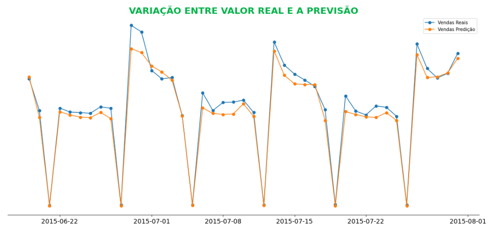
 

  

 O gráfico esta mostrando as seis semanas de teste e podemos ver que as predições ao longo do tempo esta bem próxima das vendas.

  

# _9. Conclusão_

Com o modelo selecionado, treinado e avaliado com uma boa performance, chegou a hora de coloca-lo em produção. Para isso, optamos por disponibilizar as predições do projeto de forma online através do aplicativo de mensagens Telegram.

Neste aplicativo, o usuário deverá informar para um bot criado no Telegram o ID da loja a qual deseja obter a previsão de vendas nas próximas 6 semanas. Assim, o bot retornará uma mensagem com a previsão.

 

# _10. Próximos passos_

1. Temos uma queda nas vendas ao decorrer dos anos, que precisa ser analisado, para não afetar as vendas de 2015.
   - Mas comparando o mesmo período de meses entre 2014 e 2015 temos um aumento de 6%.

2. Registros que são outliers: 101.710.
    - Devemos depois fazer uma análise mais profunda porque nem tudo pode ser um outlier.

3. Podemos perceber que as vendas no final do mês, apresenta uma queda bem acentuada nas vendas, que precisa análisar.

4. Podemos ver que o menor pico de vendas é no domingo, esta é uma informação que precisa compreender melhor este comportamento.
